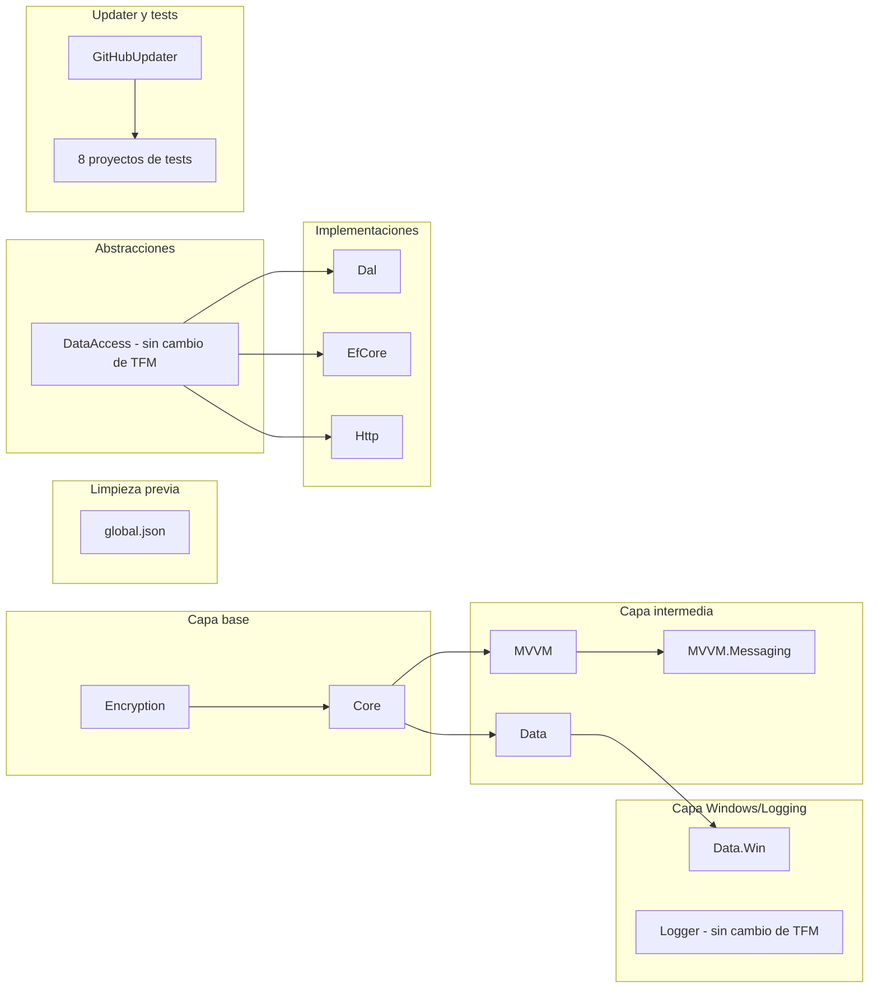

# Design — Salto del ecosistema KUtilitiesCore a .NET 10

## Context

Ver `proposal.md` — sección Why para la motivación.

Estado actual verificado en el repositorio (19 proyectos):

| Grupo | Proyectos | TFM actual | Detalle relevante |
|---|---|---|---|
| Librerías multi-target | Encryption, Core, MVVM, MVVM.Messaging, Data, GitHubUpdater | `net48;net8.0` | `LangVersion=latest`, paquetes condicionales net48 en MVVM y GitHubUpdater |
| Windows | Data.Win | `net48;net8.0-windows` | `UseWindowsForms=true`, `System.Resources.Extensions 10.*` |
| Abstracciones | DataAccess | `netstandard2.1` | Sin dependencias — se conserva |
| Logging | Logger | `netstandard2.0` | `Microsoft.Extensions.* 10.0.12` ya alineadas — se conserva |
| Implementaciones | Dal, EfCore, Http | `net8.0` | EF Core 9.0.14; Http tiene `HintPath` muerto a ensamblado net48 |
| Tests net8 | KUtilitiesCoreTests, DataAccessTests, DataTests, EventCommandBinder, LoggerTests | `net8.0` | MSTest 4.4.1 / xunit.v3 4.0.1 |
| Tests Windows | Data.WinTests | `net8.0-windows` | WinForms requerido |
| Tests heredados | MVVMTests, GitHubUpdaterTests | `net48` | Saltan 2 eras (net48 → net10) |

Entorno: SDKs 8.0.300/8.0.425 y 10.0.200/10.0.401 instalados; no existe `global.json` (cualquier comando `dotnet` resuelve hoy al último SDK 10). No hay CI activa. El gate de verificación del repo es "build warnings = verificación". Restricción organizativa: el proyecto sigue el enfoque de "cambios graduales" (AGENTS.md), por lo que el salto se ejecuta en capas verificables, no como un único cambio masivo.

## Goals / Non-Goals

**Goals:**

- Ejecutar el salto completo a net10 de forma **incremental y verificable por capas**, respetando la cadena de dependencias para mantener la solución compilable en cada punto de control.
- Dejar el repositorio en estado "0 errores, 0 advertencias nuevas respecto de la línea base" bajo los analizadores del SDK 10 (decisión de PO confirmada durante la ejecución: la deuda preexistente de 712 warnings —sobre todo CS1591, docs XML faltantes— queda fuera de alcance y se atiende en un cambio aparte).
- Dejar resuelta la fricción de tooling local (SDK resuelto = 10.x garantizado por `global.json`).

**Non-Goals:**

- Publicación de paquetes NuGet y versionado 2.0.0 (historia aparte; este cambio solo deja documentada la recomendación).
- Creación de CI/CD.
- Refactors de código fuente más allá de la remediación de warnings y de lo que exija la compilación en net10.
- Adoptar features nuevas de C# 14 (el `LangVersion=latest` ya lo permite; no forma parte del alcance).
- Cambiar la matriz de paquetes más allá de lo definido en la spec (EF Core y WebUtilities a major 10; eliminación de heredados redundantes).

## Decisions

### D1 — Eliminación total de `net48` (decisión de producto, confirmada)

Por qué: mantener `net48` en multi-target condiciona versiones de dependencias (p. ej. `System.ComponentModel.Annotations 5.*`, `System.Net.Http 4.3.4`), impide usar APIs modernas en el código compartido y duplica la matriz de pruebas. Alternativa considerada: conservar multi-target `net48;net10.0` (sin breaking change) — descartada por decisión del PO: "esta librería es un salto al .NET 10".

Consecuencia: breaking change para consumidores net48; la próxima publicación debe ser 2.0.0.

### D2 — `netstandard2.0`/`netstandard2.1` se conservan tal cual

Por qué: ambos TFM son consumibles desde .NET 10 (compatibilidad garantizada del runtime con netstandard), no generan breaking change y mantienen el alcance de consumo amplio. Alternativa: añadir `net10.0` a Logger/DataAccess — descartada porque duplica activos sin valor observable y ampliaría el alcance sin necesidad.

### D3 — Migración por capas en orden de dependencia, no en un solo commit

Orden (cada capa deja la solución compilable):



Por qué este orden: un `ProjectReference` a un proyecto aún en net8 desde uno ya en net10 falla al restaurar (net10 no puede consumir net8... en realidad net10 SÍ consume net8, pero el objetivo es que cada capa superior verifique la inferior antes de avanzar, y que los errores de compatibilidad aparezcan en la capa más cercana a su causa). Alternativa: un único commit con todos los TFMs — descartada por la regla de "cambios graduales" del repo y porque dificulta aislar warnings nuevos.

Nota técnica: net10.0 puede consumir ensamblados net8.0, por lo que el orden estricto no es un requisito del compilador, sino una estrategia de aislamiento de fallos. La única restricción dura es que `netstandard2.x` y `net10.0` son consumibles por todo lo demás.

### D4 — Paquetes: alineación selectiva

- **Actualización obligatoria**: `Microsoft.EntityFrameworkCore 9.0.14 → 10.x` (EfCore) y `Microsoft.AspNetCore.WebUtilities 8.0.25 → 10.x` (Http) — alineación con el salto.
- **Eliminación** (APIs ya en el runtime net10): `Microsoft.CSharp 4.7.0` (Core), `System.ComponentModel.Annotations 5.*` (Core, MVVM — en net10 `System.ComponentModel.DataAnnotations` está in-box; verificar el namespace usado en el código antes de eliminar), `System.Threading.Tasks.Extensions` (MVVM, condicional net48), `System.Net.Http 4.3.4` (GitHubUpdater, condicional net48), `System.Text.RegularExpressions 4.3.1` (GitHubUpdaterTests).
- **Conservar si compila y pasa tests en net10**: `Microsoft.Data.SqlClient 7.1.0`, `Moq 4.20.72`, `ClosedXML 0.105.1`, `DotNetEnv 3.2.0`, `Microsoft.Extensions.* 10.0.12`, `Newtonsoft.Json 13.0.4`, `System.Text.Json 10.0.12`, `System.Security.Cryptography.ProtectedData 10.0.12`, `System.Resources.Extensions 10.*`, MSTest/Test SDK se evalúan: si el salto genera advertencias de compatibilidad, se sube a la última compatible como parte de la remediación.

Por qué no "actualizar todo": cada major de tercero (p. ej. ClosedXML) introduce su propia superficie de breaking changes; mezclarla con la del salto de runtime haría imposible atribuir fallos. El objetivo es el TFM, no la actualización de dependencias.

### D5 — `global.json` con `rollForward: latestFeature`

```json
{ "sdk": { "version": "10.0.401", "rollForward": "latestFeature" } }
```

Por qué: fija la banda 10.x (evita que un SDK 11 futuro o el 8.x instalado cambien el comportamiento de build) y tolera parches/features dentro de la banda. Alternativa: `rollForward: disable` — descartada por fragilidad en máquinas con solo parches superiores instalados.

### D6 — Tests heredados net48: migración directa, sin reescritura

`MVVMTests` y `GitHubUpdaterTests` pasan de net48 a net10 cambiando solo el TFM; solo se adaptan los elementos que no compilen (esperables: `System.Text.RegularExpressions 4.3.1` → in-box, y usos de APIs de reflexión/`AppDomain` si aparecen). Alternativa: reescribir con `Microsoft.Testing.Platform` — descartada; el objetivo del salto es conservar la cobertura, no modernizar la infraestructura de pruebas.

### D7 — Documentación como tarea de cierre

AGENTS.md (tabla de proyectos, notas de pruebas y arquitectura) y README raíz se actualizan al final, cuando la matriz final es un hecho verificable, no antes.

## Risks / Trade-offs

- [Breaking changes del salto 8→10 (dos LTS de distancia)] → Migración por capas con build+test en cada punto de control; los fallos se manifiestan en la capa más cercana a su causa.
- [Warnings nuevos de analizadores del SDK 10 bloquean el gate "0 warnings"] → Capa de remediación explícita tras el flip de TFMs; presupuesto de tiempo para investigar cada warning nuevo; si un warning es un falso positivo estable, evaluar pragma puntual documentado — nunca `NoWarn` global. **Nota de ejecución (PO)**: la línea base ya contiene 712 warnings preexistentes (predominan CS1591 y CS86xx); el gate se define como "0 errores y 0 advertencias nuevas respecto de la línea base" y la deuda preexistente queda como cambio aparte.
- [Compatibilidad de `Moq`/`MSTest`/`SqlClient` con net10] → Regla D4: se conservan y, si generan advertencias o fallos, se sube versión como parte de la remediación de esa capa, aislada por proyecto de tests.
- [`MVVMTests.EventCommandBinder` ya sufrió incompatibilidad previa con el SDK 10 (commit `3230c99`, fix aplicado)] → Validación específica de ese proyecto en su capa; su configuración `UseMicrosoftTestingPlatform` ya fue ajustada en su momento.
- [`System.ComponentModel.DataAnnotations` in-box cambia el namespace efectivo frente al package `Annotations`] → Antes de eliminar el package en Core/MVVM, verificar con grep qué namespaces consume el código (`System.ComponentModel.DataAnnotations` vs `System.ComponentModel.Annotations`); ajustar `using` solo si difieren.
- [DPAPI (`ProtectedData`) es Windows-only en ejecución] → Fuera del alcance del TFM (net10.0 compila y el package 10.0.12 declara soporte); se documenta que el uso de DPAPI sigue requiriendo Windows.
- [Sin CI: la validación es 100% local] → Cada capa termina con `dotnet build` + `dotnet test` completos ejecutados y verificados; la creación de CI queda como historia futura.
- [Consumidores net48 rotos en cuanto se publique] → Mitigado fuera del scope: versionar como 2.0.0 y anunciar en las notas de publicación (documentado en proposal y spec).

## Migration Plan

1. Rama dedicada (`feature/migrate-to-dotnet10`) — sin `global.json` previo que complique el cambio.
2. `global.json` + limpieza previa (HintPath muerto de Http, PropertyGroups WarningLevel net48 de Core) — la solución sigue compilando en SDK 8/10.
3. Flip de TFMs capa por capa (D3), con build completo al final de cada capa.
4. Remediación de warnings nuevos hasta 0 (respecto de la línea base).
5. Suite completa de tests en verde.
6. Actualización de documentación (D7).
7. Estrategia de rollback: cada capa es un commit atómico; revertir el commit de la capa restaura el estado previo. El estado completo previo al salto queda en la rama principal (merge solo al final).

## Open Questions

- Ninguna que condicione specs, enfoque o descomposición de tareas. La versión exacta de `MSTest`/`Test SDK` tras el salto se decide en ejecución (D4); la decisión de publicación/2.0.0 es una historia aparte.
